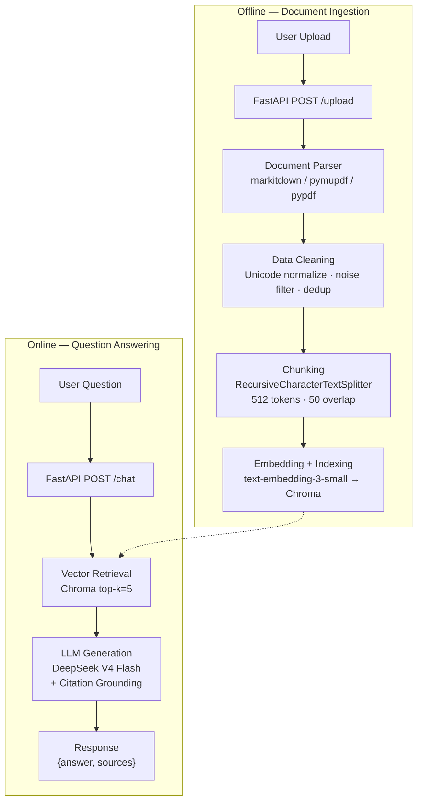

# Personal Knowledge Base RAG

A personal knowledge base system built with RAG (Retrieval-Augmented Generation). Upload documents, ask questions, get AI-generated answers with source citations.

## Architecture



## Features

- **Multi-format document parsing** — PDF (via markitdown → pymupdf → pypdf fallback chain), Markdown, TXT
- **Data cleaning pipeline** — Unicode normalization, header/footer filtering, near-duplicate detection with MinHash + LSH
- **Smart chunking** — Recursive character splitting with overlap, section-aware via separator priority
- **Vector search** — Chroma with OpenAI text-embedding-3-small, metadata-rich chunks
- **Citation-grounded answers** — Every claim linked to source document and chunk
- **RAGAS evaluation** — Faithfulness, Response Relevancy, Context Precision/Recall metrics
- **Streamlit UI** — Upload tab + chat interface with source highlighting

## Tech Stack

| Layer | Choice |
|-------|--------|
| Backend | FastAPI |
| RAG Framework | LangChain |
| Vector DB | Chroma (embedded, persistent to `./chroma_db/`) |
| LLM | DeepSeek V4 Flash via OpenRouter |
| Embeddings | text-embedding-3-small via OpenRouter |
| PDF Parsing | markitdown (primary), pymupdf, pypdf (fallbacks) |
| Frontend | Streamlit |
| Eval | RAGAS |
| Tracing | LangSmith |

## Quick Start

### 1. Clone and set up environment

```bash
git clone <repo-url>
cd personal_knowledge_rag

python -m venv venv
venv\Scripts\activate      # Windows
# source venv/bin/activate  # macOS / Linux

pip install -r requirements.txt
```

### 2. Configure environment variables

```bash
cp .env.example .env
```

Edit `.env` and fill in your keys:

| Variable | Description |
|----------|-------------|
| `OPENROUTER_API_KEY` | OpenRouter API key ([get one here](https://openrouter.ai/keys)) |
| `MODEL_NAME` | LLM model (default: `deepseek/deepseek-v4-flash`) |
| `LANGCHAIN_API_KEY` | (Optional) LangSmith key for tracing |

### 3. Start the backend

```bash
uvicorn app:app --reload --host 0.0.0.0 --port 8000
```

### 4. Start the frontend (separate terminal)

```bash
streamlit run streamlit_ui.py
```

### 5. Use the app

1. Open http://localhost:8501
2. Upload a PDF, Markdown, or TXT file in the sidebar
3. Ask questions in the chat

## API Reference

| Method | Endpoint | Description |
|--------|----------|-------------|
| `POST` | `/upload` | Upload a document. Form-data with `file` field. Returns `{file_id, stored_chunks, duplicates_removed, cleaning_stats}` |
| `POST` | `/chat` | Ask a question. JSON body: `{"question": "..."}`. Returns `{answer, sources, retrieved_chunks}` |
| `GET` | `/documents` | List all uploaded documents with metadata |
| `DELETE` | `/documents/{file_id}` | Delete a document and its vectors |

### Example

```bash
# Upload
curl -F "file=@report.pdf" http://localhost:8000/upload

# Chat
curl -X POST http://localhost:8000/chat \
  -H "Content-Type: application/json" \
  -d '{"question": "这份报告的核心结论是什么？"}'
```

## Evaluation

After indexing some documents, run the RAGAS evaluation:

```bash
python evaluate.py
```

This runs test queries through the retrieval + generation pipeline and reports:

- **Faithfulness** — are claims grounded in retrieved context?
- **Response Relevancy** — does the answer address the question?
- **Context Precision** — are retrieved chunks relevant?
- **Context Recall** — are all relevant chunks retrieved? (requires ground truth)

Edit `load_test_questions()` in `evaluate.py` to match your documents. Results are written to `eval_report.json`.

## Project Structure

```
personal_knowledge_rag/
├── app.py                # FastAPI application + API routes
├── rag_engine.py         # RAG core: parsing, chunking, embedding, retrieval, generation
├── cleanup.py            # Data cleaning: normalization, noise filtering, MinHash dedup
├── streamlit_ui.py       # Streamlit frontend
├── evaluate.py           # RAGAS evaluation script
├── requirements.txt
├── .env.example          # Environment variable template
├── data/                 # Uploaded documents (one subdirectory per file_id)
├── chroma_db/            # Chroma vector store persistence
└── README.md
```

## Design

- **Brownfield-first** — real documents have headers, footers, repeated boilerplate. The cleaning pipeline handles this before it reaches retrieval.
- **No premature abstraction** — three files (app, rag_engine, cleanup) cover the entire system. Easy to read end-to-end.
- **Deterministic dedup** — MinHash with fixed seed (42) for reproducible results across runs.
- **Graceful degradation** — PDF parsing tries three backends. If markitdown fails, pymupdf. If pymupdf fails, pypdf.
- **Interviewer-friendly** — architecture diagram in Mermaid, clean type hints, inline stats on every upload.
